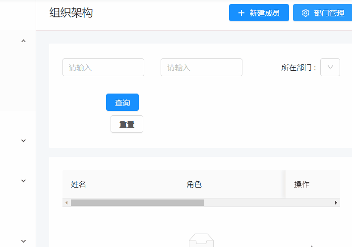

## ngx-architect-tree

Angular 中一种通用业务组件，组织架构管理

使用场景：公司部门管理、房屋结构管理等类似树形组织结构都可以使用



### 基本使用

```
npm i ngx-architect-tree -D

// 注册组件
import { NgxArchitectTreeModule } from 'ngx-architect-tree';
@NgModule({
  imports:[
    ...,
    NgxArchitectTreeModule
  ]
})
// 使用组件

<button nz-button (click)="showArchitectTree=true" [nzType]="'primary'">
  <i nz-icon nzType="copy" nzTheme="outline"></i>
  <span>组织架构管理</span>
</button>

<ngx-architect-tree [show]="showArchitectTree" cate="ARTICLE" label="部门" [listApi]="api.getTagList"
  [saveApi]="api.saveTag" [deleteApi]="api.deleteTag" (closeEvent)="showArchitectTree=false"></ngx-architect-tree>
```

### API

- 输入属性

  show:boolean，控制组织架构弹窗的显示

  label: 组织架构弹窗文案控制，默认“部门”，如果用于房屋结构管理，则传入“房屋”,弹窗文案会变为房屋管理，新增房屋等等

  listApi: 列表接口，GET/POST 参数 cate 标识分类

  saveApi: 新增或修改接口 POST 参数 id,name,parentId

  deleteApi: 删除接口 POST 参数 id

- 输出属性

  closeEvent 关闭标签弹窗事件
